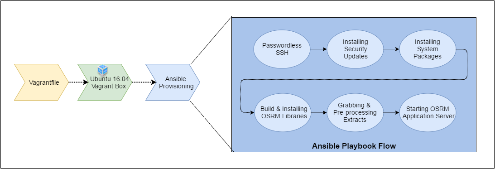

# Systems & Operations

##1.1 – Server Provisioning

Write a Vagrantfile (see https://www.vagrantup.com/) to create a bare Ubuntu 16.04 LTS server with 2 GB of RAM for local use.

Write an Ansible playbook to provision this local server, including:

• The latest security updates.

• Any missing tools you consider crucial for the good operation of a server.

• Any missing tools you consider helpful for the good operation of a server.

• OSRM (see https://github.com/Project-OSRM/osrm-backend), configured with data for Berlin.

Clearly distinguish between which tools you consider crucial and which tools you consider helpful.

## 1.2 – Operations

Consider having to put the trip-routing component above live in a cloud environment, such as Amazon Web Services, on a full planet offload (not just a single city). Describe how you would bring this task to a good
end.

Take into account the following aspects:

• Deployment/Provisioning

• Security

• Scaling

• Operational Procedures

• Monitoring/Alerting

• Anything else you deem important

An overview that covers the major points is better than a detailed handling of a single aspect.


# Solutions

##1.1 – Server Provisioning



###Prerequisites

Following Applications are required to be installed for the above task

* [Vagrant](https://www.vagrantup.com/downloads.html)
* [Virtual Box](https://www.virtualbox.org/wiki/Downloads)
* [Ansible](https://www.ansible.com/)


```sh
$ git clone https://github.com/shahrukhkhan489/Task-Sentiance.git
$ cd Task-Sentiance
$ vagrant up
```

## 1.2 – Operations


As seen in the above diagram, the following architecture will be required to put the OSRM trip-routing component live in a cloud environment for full planet offload

To bring the task to a good end following aspects should be taken

#### Deployment/Provisioning

#### Security

#### Scaling

#### Operational Procedures

#### Monitoring/Alerting

#### Anything else you deem important